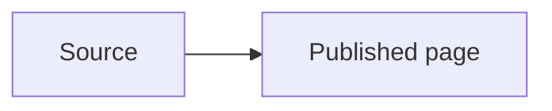

Equation $x^2$, a table, a footnote,[^one] and a fenced block.

| Feature | Result |
| --- | --- |
| Table | Rendered |

```python
print("fixture")
```


```mermaid
flowchart LR
  source[Source] --> page[Published page]
```

[^one]: Fixture footnote.
